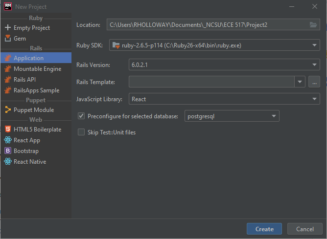
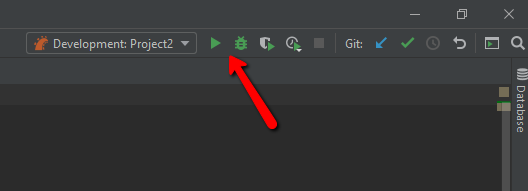
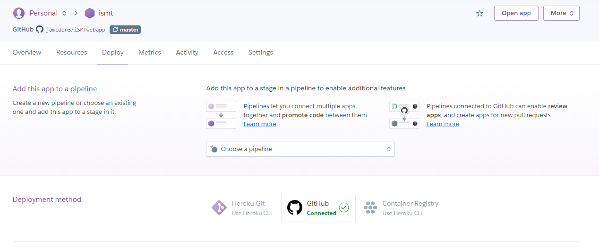

# CSC/ECE 517 Program 2: A Ruby on Rails Tour Management System
A Ruby on Rails implementation of a travel agent application

## Getting Started
### Project Setup
Project configured as shown in the figure below. Project is backed by a postgresql database, so it can easily be hosted on Heroku.

#### Problems:
1. Yarn not installed - Install [yarn](https://legacy.yarnpkg.com/lang/en/docs/install/#windows-stable) and restart Ruby Mine.
2. Run `npm i` - Generator suggested running `npm i` to install node packages. Node was previously installed on my system. Node v12.14.0. npm 6.13.4

### Running the App

#### Problems:
1. Hitting the stop button in the top bar does not actually kill the server on Windows 10. Must delete the file at `\tmp\pid\server.pid` if the server is stopped this way.

### Depoloyment on Heroku
1.  Visit the Heroku website and create an account.
2.  Create a new app, and under the deployment options, proceed with automatic connection to Github repository.  

Note: If automatic deployment with Github fails, feel free to follow up with Heroku CLI for additional debugging tools.  
